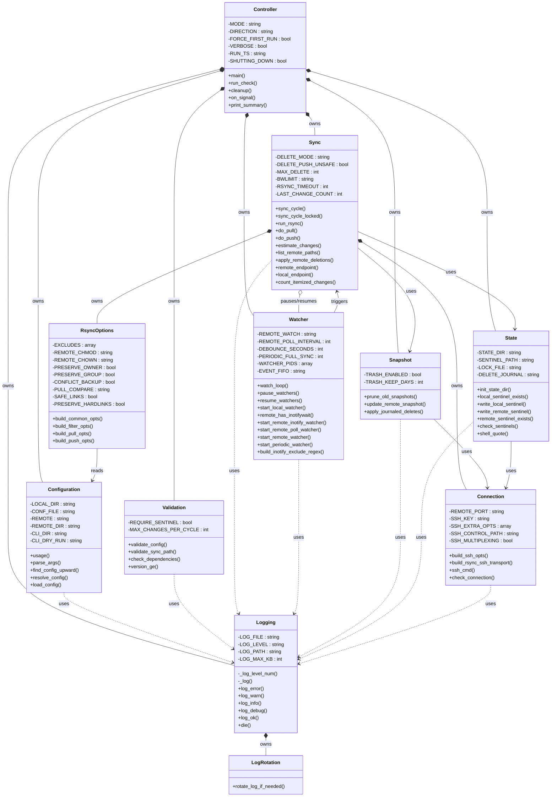

# OOP Class Diagram for `mirror-remote-directory.sh`

`mirror-remote-directory.sh` is a bash script, not a true OOP language, but its
functions cluster tightly around distinct responsibilities and shared state.
This document maps that structure onto a conventional UML class diagram:
each "class" is a conceptual module, each bash global becomes an attribute of
the class that owns it, and each function becomes a method. Bash has no
enforced visibility, so the `_`-prefix naming convention is treated as
`private` and everything else as `public`.

## Diagram

## Class Descriptions

| Class | Responsibility |
|---|---|
| `Controller` | Top-level orchestrator. Entry point, run mode dispatch (`watch`/`once`/`check`), signal handling, and shutdown/summary reporting. |
| `Configuration` | Argument parsing and config-file loading; locates `sync.conf` by searching upward from the working directory. |
| `Validation` | Validates the resolved configuration, sync paths, and required external tool availability/versions. |
| `Logging` | Centralized logging facility with severity levels (`error`/`warn`/`info`/`debug`/`ok`) and a `die()` fatal-error path. |
| `LogRotation` | Rotates the log file once it exceeds a configured size, so it stays bounded. |
| `State` | Owns the `.sync` state directory and the sentinel files used to detect first-run and track sync progress. |
| `Snapshot` | Snapshot-based remote-file tracking used to detect and journal deletions, with trash retention. |
| `Connection` | Builds SSH options/transport and multiplexed control sockets; verifies remote reachability. |
| `RsyncOptions` | Builds the `rsync` argument sets (common, filter, pull, push) from the loaded configuration. |
| `Sync` | Core sync engine: pull/push cycles, change estimation, remote path listing, and deletion propagation. |
| `Watcher` | File-change detection: local `inotifywait`, remote `inotifywait`/polling, and a periodic full-sync fallback. |

## Relationship Legend

- `*--` **Composition** — the owning class creates and is responsible for the lifetime of the owned class's state (e.g. `Controller` composes `Configuration`, `Sync` composes `Connection`).
- `o--` **Aggregation** — a looser "has-a" link where the related object exists independently (`Sync` aggregates `Watcher`: it pauses/resumes it, but does not own its lifecycle — `Controller` does).
- `-->` **Association** — one class calls into another's public interface without owning it (e.g. `Sync --> State`).
- `..>` **Dependency** — a lightweight, typically read-only or cross-cutting usage (nearly every class depends on `Logging`).

## Notes

- Private methods are prefixed with `_` in the source (e.g. `_log`, `_log_level_num`) and are marked `-` (private) above; everything else is marked `+` (public).
- Attributes shown are the bash global variables each class reads or writes; the script itself has no formal encapsulation, so this grouping reflects usage patterns rather than enforced scope.
- `RsyncOptions` depends on `Configuration` for its inputs (excludes, ownership/permission settings) but has no reverse dependency.
- `Sync` and `Watcher` have a mutual relationship: `Sync` pauses/resumes `Watcher` during a sync cycle, and `Watcher` triggers `Sync` cycles on detected changes.
