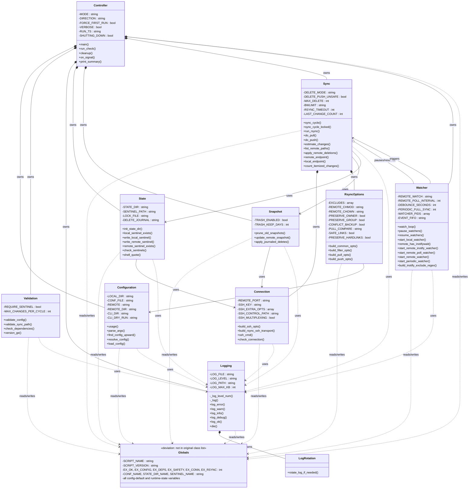

# OOP Class Diagram for `mirror-remote-directory.sh`

`mirror-remote-directory.sh` is a bash script, not a true OOP language, but its
functions cluster tightly around distinct responsibilities and shared state.
This document maps that structure onto a conventional UML class diagram:
each "class" is a conceptual module, each bash global becomes an attribute of
the class that owns it, and each function becomes a method. Bash has no
enforced visibility, so the `_`-prefix naming convention is treated as
`private` and everything else as `public`.

The classes below are no longer just a conceptual grouping: the codebase is
physically split along these lines, one `lib/*.sh` file per class (see
[Source Layout](#source-layout)). `mirror-remote-directory.sh` itself is now a
thin entry point that sources `lib/*.sh` in dependency order and calls
`main`.

## Diagram

## Class Descriptions

| Class | Responsibility |
|---|---|
| `Globals` *(deviation)* | Shared constants, config defaults, and runtime state. Not a behavioural class — see [Deviations](#deviations-from-the-diagram). |
| `Controller` | Top-level orchestrator. Entry point, run mode dispatch (`watch`/`once`/`check`), signal handling, and shutdown/summary reporting. |
| `Configuration` | Argument parsing and config-file loading; locates `sync.conf` by searching upward from the working directory. |
| `Validation` | Validates the resolved configuration, sync paths, and required external tool availability/versions. |
| `Logging` | Centralized logging facility with severity levels (`error`/`warn`/`info`/`debug`/`ok`) and a `die()` fatal-error path. |
| `LogRotation` | Rotates the log file once it exceeds a configured size, so it stays bounded. |
| `State` | Owns the `.sync` state directory and the sentinel files used to detect first-run and track sync progress. |
| `Snapshot` | Snapshot-based remote-file tracking used to detect and journal deletions, with trash retention. |
| `Connection` | Builds SSH options/transport and multiplexed control sockets; verifies remote reachability. |
| `RsyncOptions` | Builds the `rsync` argument sets (common, filter, pull, push) from the loaded configuration. |
| `Sync` | Core sync engine: pull/push cycles, change estimation, remote path listing, and deletion propagation. |
| `Watcher` | File-change detection: local `inotifywait`, remote `inotifywait`/polling, and a periodic full-sync fallback. |

## Relationship Legend

- `*--` **Composition** — the owning class creates and is responsible for the lifetime of the owned class's state (e.g. `Controller` composes `Configuration`, `Sync` composes `Connection`).
- `o--` **Aggregation** — a looser "has-a" link where the related object exists independently (`Sync` aggregates `Watcher`: it pauses/resumes it, but does not own its lifecycle — `Controller` does).
- `-->` **Association** — one class calls into another's public interface without owning it (e.g. `Sync --> State`).
- `..>` **Dependency** — a lightweight, typically read-only or cross-cutting usage (nearly every class depends on `Logging`).

## Notes

- Private methods are prefixed with `_` in the source (e.g. `_log`, `_log_level_num`) and are marked `-` (private) above; everything else is marked `+` (public).
- Attributes shown are the bash global variables each class reads or writes; the script itself has no formal encapsulation, so this grouping reflects usage patterns rather than enforced scope.
- `RsyncOptions` depends on `Configuration` for its inputs (excludes, ownership/permission settings) but has no reverse dependency.
- `Sync` and `Watcher` have a mutual relationship: `Sync` pauses/resumes `Watcher` during a sync cycle, and `Watcher` triggers `Sync` cycles on detected changes.

## Source Layout

`mirror-remote-directory.sh` sources these in order and then calls `main`:

| File | Class(es) |
|---|---|
| `lib/globals.sh` | `Globals` |
| `lib/logging.sh` | `Logging`, `LogRotation` |
| `lib/config.sh` | `Configuration` |
| `lib/validation.sh` | `Validation` |
| `lib/state.sh` | `State` |
| `lib/connection.sh` | `Connection` |
| `lib/rsync_options.sh` | `RsyncOptions` |
| `lib/snapshot.sh` | `Snapshot` |
| `lib/sync.sh` | `Sync` |
| `lib/watcher.sh` | `Watcher` |
| `lib/controller.sh` | `Controller` |

The sourcing order matters for exactly one reason: `lib/globals.sh` must load
first, because it declares every default/runtime variable that later files
reference under `set -u`. Beyond that, load order is not load-bearing — every
function is resolved at call time (after all files are sourced and `main`
runs), not at source time.

## Deviations from the Diagram

The implementation split follows the diagram closely, with two deliberate
departures, made for practical reasons specific to bash rather than for
better OOP fidelity:

1. **`Globals` was added.** Bash has no per-object storage — every "class"
   here is really a set of functions operating on shared process-global
   variables. The original diagram folded config defaults and runtime state
   into `Configuration`'s attribute list, but in practice those globals
   (exit codes, `SCRIPT_NAME`, sentinel/state-dir names, and every
   user-configurable and derived-at-runtime variable) are read and written by
   *all* of the classes, not just `Configuration`. Declaring them once in
   `lib/globals.sh`, sourced first, avoids `set -u` load-order failures that
   would appear if each class's own variables were declared in that class's
   own file (a class sourced before the one owning a variable it reads would
   crash on an unset variable). This is a concession to bash's lack of
   namespacing, not a claim that `Globals` is a real behavioural class — it
   has no methods and isn't a dependency in the OOP sense, which is why its
   diagram relationships are drawn as dependency (`..>`) from everything
   else, never composition.

2. **`LogRotation` shares `lib/logging.sh` with `Logging`** rather than
   getting its own `lib/log_rotation.sh`. It is a single function
   (`rotate_log_if_needed`) used only alongside `Logging`'s own functions, so
   a dedicated file would have added a module with no other reader for no
   maintenance benefit. The diagram still lists `LogRotation` as a distinct
   class — the composition relationship (`Logging *-- LogRotation`) reflects
   the code's actual responsibility split even though both live in one file.
